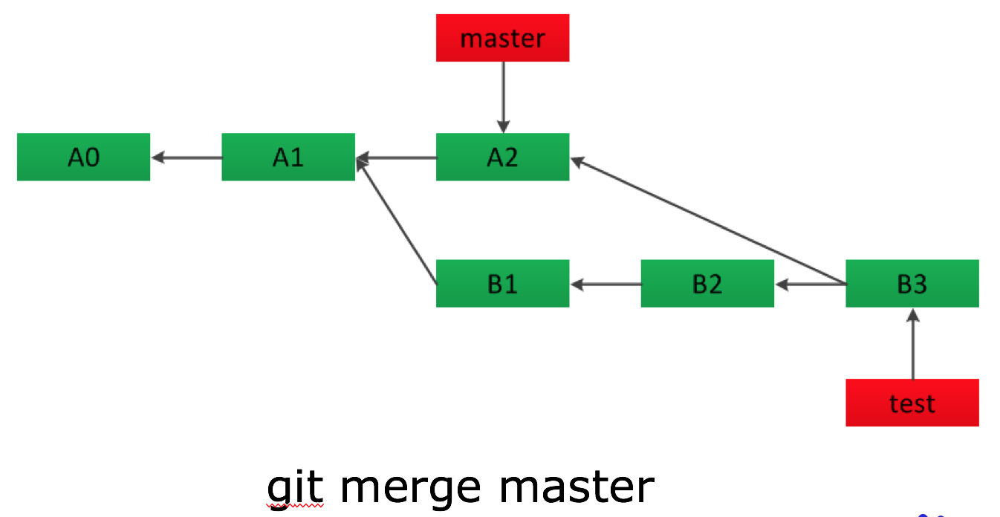

## 分支合并

## 分支介绍
假如基于master，创建了新的分支test。

## fast-forward 合并

如果master上没有修改，test上做了一些改动，master 合并test，即如果待合并的分支在当前分支的下游，也就是说没有分叉时，会发生快速合并:

> fast-forward

这种方法相当于直接把master分支移动到test分支所在的地方，并移动HEAD指针。

## 分支出现分叉之后的合并

如果master上有修改，test上也做了一些改动，这时候两个分支出现了分叉，合并时，被合入的分支会创建一个新的节点。

## 没有冲突的合并

但是如果两个分支改动的不是同一个文件，不管是master合并test，还是test合并master，都不会有冲突,合并时提示：

> Merge made by the 'recursive' strategy.

## 存在冲突的合并

如果master上有修改，test上做了一些改动，同一个文件在两个分支上都有修改，合并时就会出现冲突，提示：

> CONFLICT (content): Merge conflict in xxxx.
> Automatic merge failed; fix conflicts and then commit the result.

需要手动处理冲突，然后commit;如果处理冲突出现问题，会导致合并遗漏。

