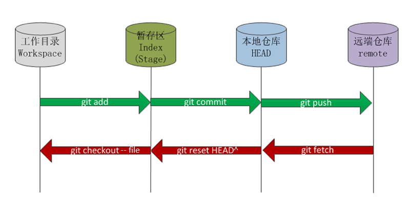
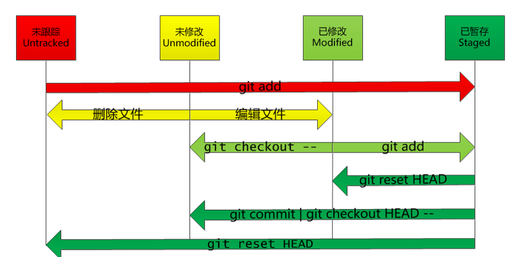

# Git 使用培训

## git状态图

工作区(Working Directory)、暂存区(Stage or index),本地仓库(Local Repository)、远端仓库(Remote Repository)

## 文件状态迁移图

1. 新建文件 untracked(未跟踪的) U
2. 已经添加到git里面的文件，Unmodified(没有修改)
3. 已经添加到git里面的文件被修改过 Modified(已修改) M
4. 1和3 通过`git add`添加到暂存区 Staged(已暂存)

